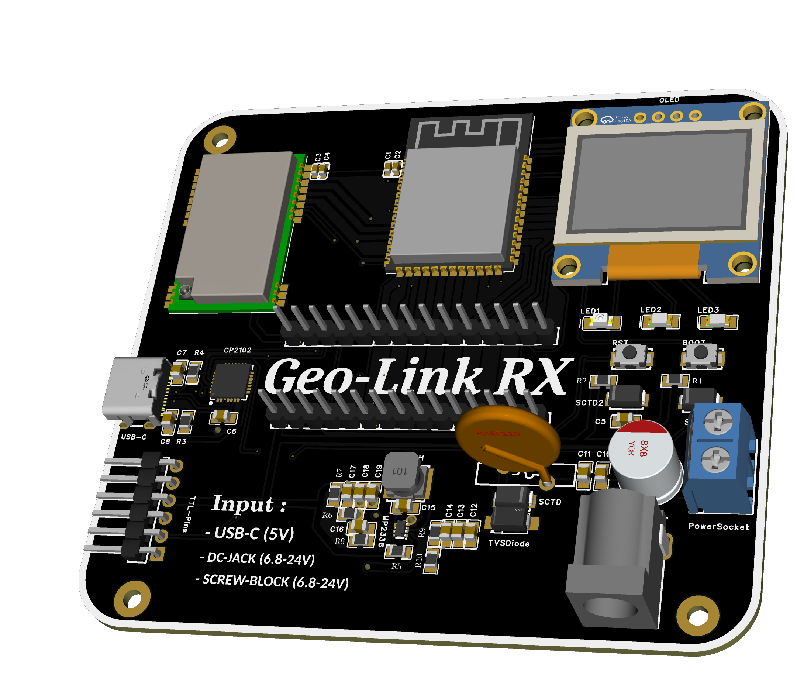
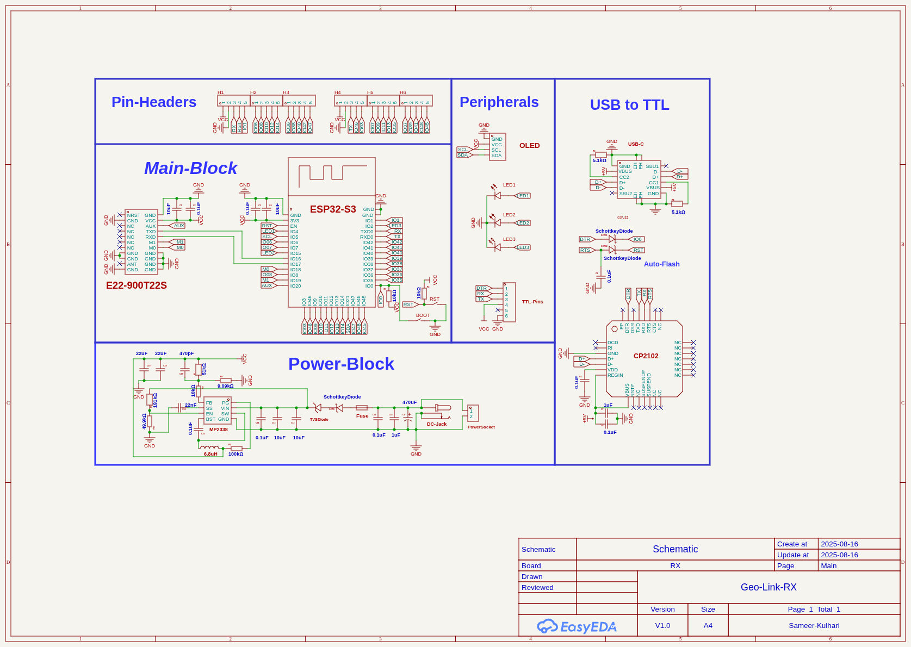
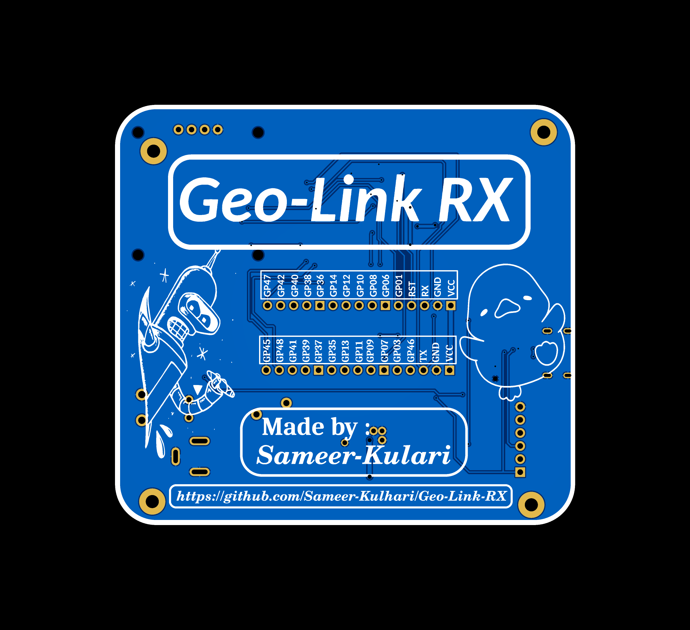
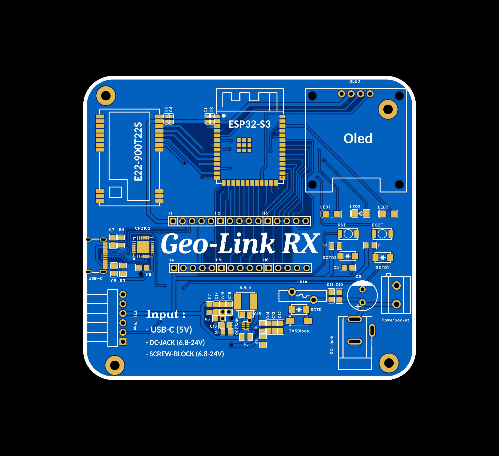

# Geo-Link-RX
This is a custom-designed LoRa Receiver (RX) board based on the ESP32-S3 WROOM-1 and E22 LoRa module (866 MHz), optimized for long-range, low-power communication. The board includes an onboard OLED display, FTDI header and USB-C for programming, and a GPIO expansion header for additional peripherals. It also integrates proper power input with a range of 5v to 28v and triple power options.

# Features :
- High-Range
- Low-latency
- Oled and Leds
- Power input (5v to 28v )
- Usb-C
- FTDI headers and Gpio Headers

# Parts Used :
- ESP32-S3 WROOM-1
- E22 LoRa module (866 MHz)
- Oled (0.96 inch)
- MP2338 High end Buck Converter
- CP2102

# Images :
**PCB :**

  
  

  
  

